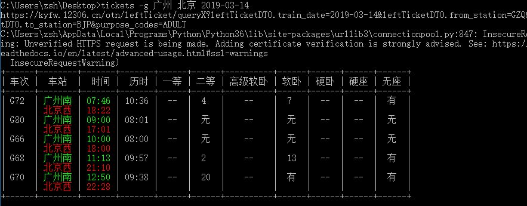
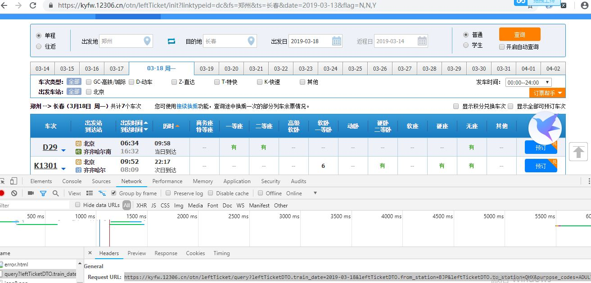

# 12306ticketquerytool
```
sudo pip install requests,prettytable,docopt
```
```
sudo pip install --upgrade colorama
```
*结果展示*
<p align="center">

</p>

1.爬取车站字母
```
python paser_station.py
```
2.按照tickets [-gdtkz] <from> <to> <date> 查询车票
```
python tickets.py -g  广州 北京 2019-03-14
```
3.如果想让脚本在任意地方使用，可以借助python的setup工具，写一个简单的脚本
运行setup.py,脚本可以通过tickets [-gdztk] from to date
```
python setup.py install
```
  
# Note
查询失效，在官网点击查询，打开开发者工具中的network,将出现的接口与tickets.py中的查票接口进行更换
<p align="center">

</p>
